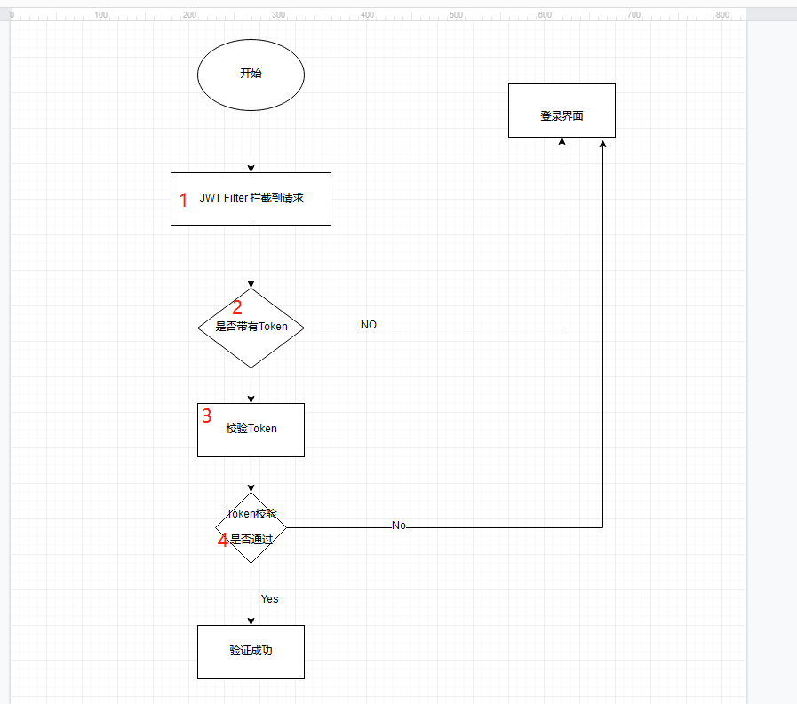

Spring Boot2x +redis+JWT+Swagger2+Mybatis 实战脚手架

- 快速上手搭建企业实战框架(全程注释)
- 快速熟悉Spring boot
- 前后端分离 分布式sessionId 管理
- 掌握redisTemplate 的使用姿势
- 掌握 shiro
- 掌握 JWT的使用姿势(token refreshToken 使用姿势)
- 掌握Swagger2x
- 掌握generatorConfiguration 逆向生成代码
- 掌握权限管理系统的业务

关键点

sessionId 管理

- 有状态：
  - 就是用户登录进来生成一个token(UUID) 存在redis 并设置过期时间，把token返回给客户端，每次客户请求后端接口都把token带上，后端拦截器拦截到请求后校验token，如果token通过校验则进入controller处理具体业务，校验不通过引导用户到登录界面重新登录

- 无状态：
  - 用户登录进来用 JWT 生产两个token (access_token过期时间短、refresh_token过期时间长) ，每次客户端请求后端接口都把access_token带上经过后端 JWT Filter 拦截后校验携带的access_token，如果通过校验则进入controller处理具体业务，校验不通过后端返回特定的状态码告知客户端携带refresh_token来刷新token，首先后端要校验refresh_token,校验通过生成新的access_token,校验不通过引导客户端到登录界面。

JWT 使用姿势

解读：

1. 首先判断access_token 是否为空  
               ` 
               
               //为空抛出特定异常引导到登录界面   
       			if(StringUtils.isEmpty(token)){  
                       throw new BusinessException(BaseResponseCode.TOKEN_ERROR);  
                   }`
2. 校验token
              `
               
              /**
                * 用户主动退出 引导用户到登录界面
                */
               if(redisService.hasKey(Constant.JWT_REFRESH_TOKEN_BLACKLIST+accessToken)){
                   throw new BusinessException(BaseResponseCode.TOKEN_ERROR);
               }`
               /**
                * 存在这个key 说明接口已经刷新过还没有来得及更换新的 token
                * 直接放行 进入到 controller处理具体业务
                */
               if(redisService.hasKey(Constant.JWT_REFRESH_STATUS+accessToken)){
                   return true;
               }
               /**
                * token 已经过期 或者主动去刷新
                * 返回特定响应码 告知客户端去调用刷新token 接口
                * 刷新成功后拿到新的token 然后再重新请求接口
                */
                 if(JwtTokenUtil.isTokenExpired(accessToken,tokenSettings.getSecretKey())||redisService.hasKey(Constant.JWT_REFRESH_KEY+accessToken)){
                   throw new BusinessException(BaseResponseCode.TOKEN_PAST_DUE);
               }
   Constant.JWT_REFRESH_STATUS+accessToken 这个key判断就是为了防止一个功能一次性请求多个接口多次刷新token。
   

      
